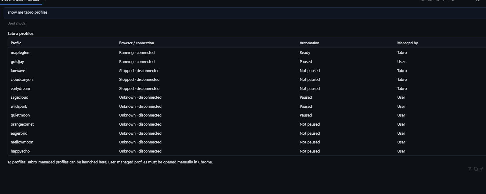
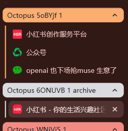
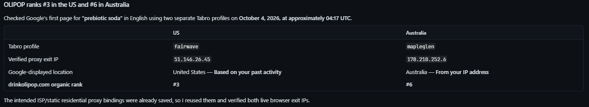
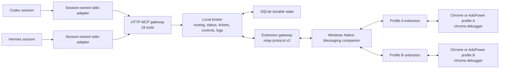

# Tabro

[English](./README.md) | [简体中文](./README.zh-CN.md) | [中文文档](./doc/zh-CN/README.md)

Give AI-agent sessions brokered, profile-aware access to multiple local Chrome or AdsPower browsers through MCP.

Tabro was previously named Octopus Browser Relay. New MCP registrations use `tabro`; existing profile data, extension identity, Native Messaging registration, and legacy environment variables remain compatible. The repository is now [ohmyskyhigh/tabro](https://github.com/ohmyskyhigh/tabro); the previous repository address redirects to it, and historical release asset filenames remain valid.

Tabro connects a local MCP gateway to one extension instance in each browser profile. An agent asks for browser capacity, receives broker-issued workspace and tab references, submits extension-supported Chrome DevTools Protocol (CDP) commands, and polls durable request tickets. The extension relays those commands through `chrome.debugger`; Chrome does not need a public remote-debugging port.

> [!IMPORTANT]
> The `0.3.1` development tree implements the canonical eighteen-tool runtime, relay-v2 protocol, Native Messaging path, and extension-backed CDP adapter. A packaged `0.3.1` release has not been published. The existing `v0.3.0` release uses the previous Octopus name and fourteen-tool contract; use the [source installer](#the-installer-builds-registers-and-prepares-the-local-runtime) for current Tabro features and automatic managed Profile lifecycle. Automated verification and physical Chrome, AdsPower, Codex, and Hermes qualification are separate gates; see [Current limits](#current-limits) and the [real-world runbook](./doc/06-Files/Real-World-Runbook.md).

## Features

Screenshots from the [Tabro 0.4.0 preview](https://github.com/ohmyskyhigh/tabro/releases/tag/hermes-v0.4.0) show three core features.

### Multiple agents share one Broker

Multiple agents connect to the same local Broker and discover the same browser profiles. They can share a logged-in browser and account, or work across different profiles.



### Each agent creates separate workspaces for different tasks

Each agent can create dedicated tab-group workspaces for different tasks. The Broker tracks ownership and keeps browser commands scoped to the correct workspace, so agents can share an account without taking over each other's tabs.



### Each Broker-managed profile can use its own authenticated proxy

Configure HTTP, HTTPS, or SOCKS5 proxies with username/password authentication through MCP. With saved credentials, an agent can configure each profile while closed, open the browsers, verify their exit IPs, and compare results across regions from a single request.



## Quick start

The current source updater requires a release declaring shared runtime discovery support; it rejects older packages before stopping an existing installation. The published `v0.3.0` installer retains its older contract. Use the source installer below for the shared dynamic runtime until a qualified package is published.

### The source installer prepares the current eighteen-tool shared runtime

1. Prepare the Windows source-build prerequisites under [Requirements](#requirements), then clone this repository and open its root directory.
2. Run `pwsh -NoProfile -File .\tools\install-local.ps1 -Install -StartBroker`. Add `-EnableManagedProfiles` when using the verified managed Chrome lifecycle.
3. For external profiles, load the reported extension directory through `chrome://extensions` and wait for Native companion connection. Managed Profiles load their extension during create/open.
4. Apply `.relay-data/bootstrap/codex-mcp.toml` or the generated `hermes-mcp.txt` command, then start a new agent session and verify eighteen tools.
5. Read actual MCP and relay addresses from `.relay-data/runtime.json`. Broker health and a real managed-tab operation establish different parts of readiness.

The [Release installation section](#github-releases-provide-verified-installation-and-updates) retains the published-package procedure; its historical package contract differs from this source baseline.

## What agents can do

- discover connected browser-profile endpoints and broker-issued window choices;
- list owned persistent Profiles, create new ones, and reopen or stop existing ones;
- request one or more workspaces on distinct profiles;
- receive an initial managed tab and CDP event cursor for each workspace;
- create additional managed tabs;
- send raw CDP commands from the extension-supported capability manifest;
- poll asynchronous request tickets and read retained CDP events;
- transfer, pause, resume, terminate, or recover workspace control; and
- pause or resume every owned workspace on one endpoint.

The broker keeps the relationship among agent sessions, endpoints, windows, workspaces, tabs, tickets, and live extension connections. Agent-facing calls use broker-issued references and endpoint nicknames instead of Chrome profile IDs, extension IDs, window IDs, tab IDs, socket IDs, or debug ports.

## Architecture



Normal installed profiles use the Native Messaging companion. The companion forwards extension messages to the broker's loopback relay. Direct extension-to-WebSocket transport remains available only for diagnostics.

Read the canonical [Product definition](./doc/01-Product/Product-Definition.md), [MCP contract](./doc/03-User-Interface/MCP-Contract.md), [System architecture](./doc/04-System/System-Architecture.md), and [Component architecture](./doc/05-Components/Component-Architecture.md) for the complete design.

## Requirements

- Windows with PowerShell, current-user Native Messaging registry access, and WinHTTP WebSocket support for the checked-in native host and installer;
- Node.js `22.12.0` or newer;
- pnpm `11.19.0` or another compatible pnpm 11 release;
- Chrome, Chromium, or an AdsPower browser kernel compatible with Manifest V3 and Chrome `116` or newer; and
- Visual Studio C++ Build Tools with an x64 compiler and Windows SDK when rebuilding the native companion.

The TypeScript broker is not intrinsically tied to Windows, but the current native companion uses WinHTTP and the current registration script writes Windows registry keys.

## Installation

### The installer builds, registers, and prepares the local runtime

From the repository root, run:

```powershell
corepack enable
pwsh -NoProfile -File .\tools\install-local.ps1 -Install -StartBroker
```

The installer runs the frozen pnpm install and build unless skip switches are supplied, verifies the compiled stdio MCP adapter, registers `io.github.ohmyskyhigh.octopus_browser_relay` for the current Windows user under Google Chrome, Chromium, and the installed AdsPower/SunBrowser registry roots, migrates an attributable prototype registration, optionally starts the compiled broker, and creates these local handoff files:

```text
.relay-data/bootstrap/PAIRING.md
.relay-data/bootstrap/MCP-REGISTRATION.md
.relay-data/bootstrap/codex-mcp.toml
.relay-data/bootstrap/hermes-mcp.txt
```

It does not overwrite Codex configuration. The generated Hermes registration command updates every Hermes profile installed when it runs. The installer also leaves browser-profile data and existing broker state in place.

### Preflight reports each missing setup action as JSON

With the Broker running, use the installer’s read-only readiness entry point; it derives health addresses from the data-directory runtime record:

```powershell
pwsh -NoProfile -File .\tools\install-local.ps1
```

The standalone preflight retains fixed-port defaults. Supply discovered URLs when using it directly:

```powershell
$runtime = Get-Content -Raw .relay-data/runtime.json | ConvertFrom-Json
$mcpHealth = $runtime.mcpUrl -replace '/mcp$', '/health'
$relayHealth = ($runtime.relayUrl -replace '^ws:', 'http:') -replace '/relay$', '/health'
pwsh -NoProfile -File .\tools\real-world-preflight.ps1 -McpUrl $runtime.mcpUrl -McpHealthUrl $mcpHealth -RelayHealthUrl $relayHealth
```

The check verifies the workspace, built extension files, required manifest declarations, native executable, compiled stdio adapter, Native Messaging manifest, every configured Native Messaging registry value, generated pairing and MCP handoff files, and both health endpoints. It exits with code `10` when operator action is still required. Pass the same `-NativeRegistryRoots` values to installation and preflight when a browser build uses different roots.

The handoff validator still expects a literal broker URL in generated registration files and can report `mcp_registration_handoffs: ACTION_REQUIRED` for valid runtime-file registrations. Inspect the generated discovery/token paths and verify actual tool discovery; do not treat that warning as a passed full preflight or repeatedly reinstall. The [runbook](./doc/06-Files/Real-World-Runbook.md) records this implementation gap.

### GitHub Releases provide verified installation and updates

The release workflow produces a portable Windows ZIP, checksum and standalone updater. Repository publication records describe the older `v0.3.0` package with fourteen tools; this download procedure does not provide the current source features. The current updater rejects packages lacking `runtimeDiscoveryVersion: 1` before shutdown. For the historical published-package path, download and run its updater:

```powershell
Invoke-WebRequest `
  https://github.com/ohmyskyhigh/tabro/releases/latest/download/octopus-browser-relay-update.ps1 `
  -OutFile .\octopus-browser-relay-update.ps1
pwsh -NoProfile -File .\octopus-browser-relay-update.ps1
```

The updater installs under `%LOCALAPPDATA%\Octopus Browser Relay`, preserves durable data under its `data` directory, registers the versioned native host, starts the broker, and prints the stable extension directory. It also writes these handoff files under `%LOCALAPPDATA%\Octopus Browser Relay\bootstrap`:

```text
INSTALLATION.md
codex-mcp.toml
hermes-mcp.txt
current-release.json
```

Open `chrome://extensions`, enable developer mode, choose **Load unpacked**, and select the returned extension directory once. Do not select the downloaded ZIP itself; the updater extracts and maintains the stable extension directory.

For later updates, run the installed updater:

```powershell
pwsh -NoProfile -File "$env:LOCALAPPDATA\Octopus Browser Relay\update-local.ps1"
```

Later updates keep the unpacked-extension path unchanged. Reload the extension after updating its files to activate the new code; its pairing identity is preserved. The broker accepts different extension package versions when relay protocol negotiation succeeds and does not request a reload based on version differences.

Maintainers build the assets with:

```powershell
pnpm package:release
```

### The stop command refuses to terminate an unrelated process

An installer-started broker records its process ID in `.relay-data/broker.pid`. Stop it with:

```powershell
pwsh -NoProfile -File .\tools\stop-local-broker.ps1
```

The command inspects the recorded Windows process and stops it only when it is `node.exe` running this workspace's absolute compiled broker entry point. A missing PID file is a successful no-op; a stale PID is retained for inspection; a process mismatch is rejected without stopping anything or deleting the PID file. Use `Ctrl+C` for a foreground `pnpm dev` broker.

### Development mode runs the broker directly from TypeScript

After the one-time Native Messaging registration, use this shorter development loop:

```powershell
corepack enable
pnpm install --frozen-lockfile
pnpm build:extension
pnpm dev
```

`pnpm dev` runs `apps/broker/src/runtime/main.ts` through `tsx`. Rebuild and reload `dist/browser-extension` after extension source changes.

## Browser profile pairing

### Every browser profile loads and pairs its own extension instance automatically

Repeat these steps inside each Chrome or AdsPower profile that the broker should control:

1. Open `chrome://extensions`.
2. Enable **Developer mode**.
3. Choose **Load unpacked** and select `dist/browser-extension`.
4. Confirm the extension ID is `caekiojlchhifdomfghejkbfpmaklafe`.
5. Open **Tabro Settings**. The extension displays an editable two-word profile-local pairing code and its compact combined nickname, such as `MINT-WAVE` and `mintwave`.
6. Keep the generated code or enter two three-to-eight-letter words, keep **Native companion** selected, and choose **Save settings and reconnect** after any change.
7. Wait until the extension reports `Status: connected` with the final endpoint nickname.

The extension generates the default readable code and registers itself with the running loopback broker; there is no broker-issued code command or copy step. The saved generated or customized code remains authoritative across browser windows and restarts. An existing endpoint is renamed only after reconnect authentication proves the profile's persisted cryptographic identity. A nickname collision preserves the requested code and shows an error until you choose another. The readable code helps correlate this profile with its endpoint and is not an authorization secret. Repeat the load-and-connect steps in every participating profile.

### Direct WebSocket stays available for explicit diagnostics

The extension options page can connect directly to the `relayUrl` published in the runtime record, but that mode is not the normal Chrome or AdsPower setup. Browser kernels can block extension-initiated loopback WebSockets even when ordinary page requests to `127.0.0.1` work. Use **Native companion** for installed profiles and switch to direct WebSocket only while diagnosing transport behavior.

## Agent registration

### The installer generates a Codex stdio MCP configuration fragment

Merge `.relay-data/bootstrap/codex-mcp.toml` into the active Codex `config.toml`, then start a new Codex session. The generated fragment launches Node with `dist/mcp-stdio-adapter/src/main.js` and passes the broker URL, token-file path, and `codex` runtime label as process environment.

The token remains in `.relay-data/admin-token.txt`; the generated fragment points to that file instead of embedding the token. The repository does not choose or modify the active Codex configuration file.

### The installer generates one Hermes command for every installed profile

Open `.relay-data/bootstrap/MCP-REGISTRATION.md` and run the exact PowerShell command stored in `.relay-data/bootstrap/hermes-mcp.txt`. It discovers the default and every installed named Hermes profile, then registers the same compiled adapter with `TABRO_RUNTIME=hermes`, the broker URL, and the local token-file path in each isolated profile. Start a new session in each profile, then run:

```powershell
hermes -p <profile> mcp test tabro
```

Run the generated command again after creating another Hermes profile. Hermes CLI releases can change their configuration syntax. The current repository generates the command and readiness handoff but does not install Hermes or prove a particular external Hermes release.

### One stdio adapter process supplies caller evidence for one agent session

The adapter prefers runtime-owned environment values in this order:

- `CODEX_THREAD_ID`;
- `CODEX_SESSION_ID`;
- `HERMES_SESSION_ID`; and
- `HERMES_AGENT_SESSION_ID`.

`TABRO_RUNTIME_SESSION` can supply an explicit fallback. When none exists, the adapter generates one random session key at startup and retains it for that process. Parent-session variants are forwarded for related subagents.

The adapter forwards these facts to the HTTP broker as `x-octopus-runtime`, `x-octopus-runtime-session`, and optional `x-octopus-parent-runtime-session` headers. They are adapter-supplied evidence, not values for the model to invent or include in tool bodies.

## MCP tools

### Eighteen tools cover profile lifecycle, browser work, monitoring, recovery, and control

| Execution | Tool | Purpose |
| --- | --- | --- |
| Read | `list_browser_profiles` | List owned persistent Profiles, including stopped browsers and their observed readiness. |
| Async | `create_browser_profile` | Create an owned persistent Profile, launch Chrome, and connect its extension. |
| Async | `open_browser_profile` | Open an existing Profile or reuse its running instance. |
| Async | `stop_browser_profile` | Normally close an owned Profile after its active work ends. |
| Read | `get_browser_context` | Read one narrow, paginated broker, endpoint, window, capability, workspace, tab, or request-summary view. |
| Async | `request_browser_workspace` | Request an exact number of workspaces on distinct eligible profile endpoints. |
| Async | `create_browser_tab` | Create one managed tab in an owned workspace. |
| Async | `send_cdp_command` | Submit one supported raw CDP command to one managed tab. |
| Read | `read_cdp_events` | Read retained CDP events from a broker-issued tab cursor. |
| Read | `get_browser_request` | Read one visible request ticket. |
| Async | `take_over_workspace` | Transfer one exactly identified workspace. |
| Async | `terminate_workspace` | Reconcile running work, archive the tab group, and end the workspace. |
| Async | `resolve_browser_request` | Resolve one owner-visible request paused for confirmation. |
| Immediate | `close_browser_request` | Remove one terminal ticket from public discovery while retaining audit history. |
| Async | `stop_workspace_automation` | Pause one workspace manually. |
| Async | `resume_workspace_automation` | Reconcile and clear the workspace's manual-stop cause. |
| Async | `kill_browser_endpoint` | Pause every active workspace on one entirely owned endpoint. |
| Async | `resume_browser_endpoint` | Reconcile the endpoint and clear its endpoint-kill cause. |

Every asynchronous tool returns an accepted `request_ref` before its browser effect becomes eligible for dispatch. The agent polls that reference with `get_browser_request`. The exact request and result schemas live in [MCP-Contract.schema.json](./doc/03-User-Interface/MCP-Contract.schema.json).

The current extension capability baseline is [extension-baseline.json](./apps/shared/protocol/capabilities/extension-baseline.json). It includes selected Accessibility, DOM, Emulation, Input, Network, Page, and Runtime methods, all confined to a managed tab.

### Agents can select local images and other files with DOM.setFileInputFiles

Use `DOM.getDocument` and `DOM.querySelector` to locate an `input[type="file"]` in the managed tab, then call `send_cdp_command` with its node ID:

```json
{
  "workspace_ref": "<workspace_ref>",
  "target": { "kind": "tab", "tab_ref": "<tab_ref>" },
  "method": "DOM.setFileInputFiles",
  "params": { "nodeId": 42, "files": ["C:\\uploads\\image.png"] }
}
```

Poll the returned `request_ref` with `get_browser_request` until completion. Supply absolute paths accessible on the **browser's machine**; Tabro forwards paths and does not transfer file bytes from a remote agent. The command also accepts `backendNodeId` or `objectId` instead of `nodeId`, multiple paths for a multiple-file input, and `files: []` to clear the selection. Setting the input selects files; complete any page-specific upload or submit step afterward. See the [CDP method definition](https://chromedevtools.github.io/devtools-protocol/tot/DOM/#method-setFileInputFiles).

## Local endpoints and state

| Purpose | Default |
| --- | --- |
| MCP and MCP health | Dynamic loopback HTTP port; read `mcpUrl` in `.relay-data/runtime.json` and replace `/mcp` with `/health` |
| Extension relay and relay health | Dynamic loopback WebSocket port; read `relayUrl` in the same runtime record |
| Shared discovery | `.relay-data/runtime.json`; Native Host reads `relay-runtime.json` beside its executable |
| SQLite state | `.relay-data/relay.sqlite` |
| Generated bearer token | `.relay-data/admin-token.txt` |
| Installer-managed broker PID | `.relay-data/broker.pid` |
| Generated setup handoff | `.relay-data/bootstrap/` |

Demo and ordinary MCP sessions share one Broker. Both listeners default to port `0`, so the operating system chooses available ports. Registrations use `TABRO_RUNTIME_FILE` and a token file rather than fixed port numbers. The adapter checks the instance identity and reconnects before a new tool call after a Broker restart; it never retries a dispatched browser mutation. Native Host reads the current relay record on each connection.

The broker creates the token on first start when `RELAY_ADMIN_TOKEN` is unset. `.relay-data/` is ignored by Git.

Supported environment variables are `RELAY_HOST`, `RELAY_MCP_PORT`, `RELAY_WS_PORT`, `RELAY_DB_PATH`, `RELAY_LOG_LEVEL`, `RELAY_HEARTBEAT_TIMEOUT_MS`, `RELAY_ERROR_THRESHOLD`, `RELAY_LEASE_TTL_MS`, `RELAY_ADMIN_TOKEN`, and `RELAY_PROFILES_CONFIG`. Configuration validation lives in `apps/broker/src/runtime/config.ts`. `TABRO_RUNTIME_FILE` and `TABRO_NATIVE_RUNTIME_FILE` select the discovery outputs in `apps/broker/src/runtime/main.ts`.

## Verification

### Automated checks exercise contracts, storage, gateways, broker policy, and packaging

```powershell
pnpm lint
pnpm typecheck
pnpm test
pnpm test:e2e
pnpm build
```

`pnpm verify` runs those checks as one gate. `pnpm build` also compiles the Windows native companion and therefore needs the C++ toolchain. Use the [real-world runbook](./doc/06-Files/Real-World-Runbook.md) for physical profiles and agent runtimes.

## Troubleshooting

### A disconnected extension is diagnosed from the native host toward the broker

1. Read `relayUrl` from the runtime record, change `ws:` to `http:` and `/relay` to `/health`, and confirm it responds.
2. Confirm the extension ID is `caekiojlchhifdomfghejkbfpmaklafe` and **Native companion** is selected.
3. Confirm the extension directory still exists at the path reported by the updater.
4. Open `%LOCALAPPDATA%\Octopus Browser Relay\bootstrap\INSTALLATION.md` and verify the installed paths.
5. Reload the unpacked extension after updating its files. If it reports a required-version mismatch, update and restart the broker to remove the old version gate, then reconnect the extension.

For a source checkout, run `pwsh -NoProfile -File .\tools\real-world-preflight.ps1`. For a GitHub Release install, check both health endpoints and the generated handoff files directly.

### An agent that cannot see eighteen tools needs a fresh stdio adapter process

Confirm the broker health first. Then verify that the Codex or Hermes registration points to the generated stable adapter launcher and token-file path. Rerun `hermes-mcp.txt` if the affected Hermes profile is missing its entry, and restart the agent session after changing its MCP registration. Hermes can check that profile with:

```powershell
hermes -p <profile> mcp test tabro
```

Exactly eighteen tools must be discovered. Do not point an agent at the relay WebSocket port; agents use the stdio adapter and HTTP MCP gateway.

### Dynamic port allocation avoids conflicts without stopping unrelated applications

Both ports default to `0`; clients use the actual addresses in the discovery record. `tools/start-local-broker.ps1` serializes launches and reuses a healthy instance; the Broker also locks its data directory against duplicate startup. Use the installed `stop-installed-broker.ps1` or source checkout's `tools/stop-local-broker.ps1` for verified shutdown. Explicit nonzero port overrides remain available for compatibility.

## Current limits

- The Native Messaging host and registration installer are Windows-specific.
- The installer registers current-user host manifests for Google Chrome, Chromium, and the installed AdsPower/SunBrowser root. Another browser build or AdsPower variant that reads a different registry location needs its actual root passed through `-NativeRegistryRoots`.
- The installer generates a Codex stdio handoff without modifying Codex configuration and a Hermes command that registers every profile installed when it runs. It does not install either runtime, and a later Hermes profile requires rerunning that command.
- Independent sessions remain distinct when the host launches one adapter process per session or supplies a supported runtime session environment value. A host that deliberately reuses one adapter process across unidentified sessions also reuses that adapter identity.
- The HTTP broker confirms an accepted ticket after handing it to the stdio adapter. MCP has no transaction spanning that HTTP handoff and the adapter's later stdout write, so an adapter crash in that narrow interval can dispatch work whose ticket the agent runtime did not receive.
- The extension executes only methods published by `octopus-extension-baseline-v1`; flattened child CDP sessions are disabled.
- Relay-v2 extension envelopes are limited to 1 MiB. Capability and inventory limits are published in the same manifest.
- The relay-v1 compatibility bridge remains enabled for migration, while the public MCP gateway exposes only the canonical eighteen tools.
- The repository does not install Codex, Hermes, Chrome, or AdsPower. The current release has recorded a three-profile, independent-Codex-session, and Hermes physical qualification; another machine or browser build still requires its own preflight and physical evidence.
- There is a PID-verified broker stop command but no full uninstall command yet.

## Repository layout

```text
doc/                    Top-down knowledge vault and change governance
apps/broker/            Broker runtime, core, MCP, relay, and storage source
apps/browser-extension/ Manifest V3 extension source
apps/mcp-stdio-adapter/ Session-owned stdio bridge for Codex and Hermes
apps/native-host/       Windows Native Messaging companion source
apps/shared/protocol/   MCP schemas, relay schemas, domain facts, and capabilities
tools/                  Build, install, pairing, preflight, and test automation
tests/                  Contract, unit, integration, fault, E2E, and physical tests
dist/                   Generated broker, adapter, extension, and native artifacts
```

Start with the [top-down vault map](./doc/TOP-DOWN-MOC.md) for project knowledge and the [repository map](./doc/06-Files/Repository-Map.md) for exact implementation paths.

## Contributing

Read [CONTRIBUTING.md](./CONTRIBUTING.md), the vault [editing rules](./doc/AGENTS.md), and [SECURITY.md](./SECURITY.md) before changing contracts, routing, transport, listener scope, or identity behavior. Do not include bearer tokens, pairing codes, private browser identifiers, profile paths, or SQLite files in public reports.

## License

Tabro is available under the [MIT License](./LICENSE).

## Managed Profiles

### Agents can create and reopen persistent Chrome Profiles through MCP

The development implementation adds list_browser_profiles, create_browser_profile, open_browser_profile and stop_browser_profile under MCP contract v2. It is verified on Windows with Chrome 153.0.8010.53 and a one-time Native Messaging installation. New Profiles automatically load the extension; normal stop retains cookies, website storage and identity. This is a local development change, not a newly published release.

Use `tools/install-local.ps1 -Install -EnableManagedProfiles` for local setup, or `-EnableManagedProfiles` with a package built from this source. Broker and adapter must upgrade together. Read the [single-Agent Demo runbook](./tests/demo/RUNBOOK.md) for the two verified three-Profile runs and reproduction steps.
