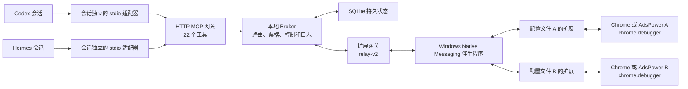

# Tabro

项目原名为 Octopus Browser Relay。新的 MCP 注册名为 `tabro`；已有 Profile 数据、扩展身份、Native Messaging 注册和旧环境变量继续兼容。GitHub 仓库已迁移至 [ohmyskyhigh/tabro](https://github.com/ohmyskyhigh/tabro)，旧仓库地址会跳转，历史发布附件保留原文件名。

[English](./README.md) | [简体中文](./README.zh-CN.md) | [中文文档](./doc/zh-CN/README.md)

Tabro 通过 MCP，让 Codex、Hermes 等 AI Agent 会话以可审计、按浏览器配置文件隔离的方式控制本机多个 Chrome 或 AdsPower 浏览器。

每个浏览器配置文件安装一个扩展实例。Agent 向本地 Broker 申请工作区，获得 Broker 签发的 `workspace_ref`、`tab_ref` 和请求票据，再通过扩展支持的 Chrome DevTools Protocol（CDP）子集执行浏览器操作。扩展使用 `chrome.debugger`，无需公开暴露 Chrome 远程调试端口；受管启动内部使用 loopback 管理连接。

> [!IMPORTANT]
> `0.4.0` 版本实现 22 个 MCP 工具、HTTP(S)/SOCKS5 账号密码代理、relay-v2、Native Messaging、扩展 CDP 适配器及受管 Profile 生命周期。[Hermes 插件](./integrations/hermes/README.md)包含 Windows 运行组件和首次 setup；商城收录仍需上游审核。已有 `v0.3.0` Release 使用旧 Octopus 名称和 14 工具协议；使用当前 Tabro 功能和自动管理 Profile 时，请按下方“源码安装”构建。自动化检查与本机演示分别验证；不同机器仍需完成自己的预检和真实浏览器测试。

## 功能展示

以下 [Tabro 0.4.0 预览版](https://github.com/ohmyskyhigh/tabro/releases/tag/hermes-v0.4.0)截图展示三个核心功能。

### 多个 Agent 共用一个 Broker

多个 Agent 连接同一个本地 Broker，发现同一组浏览器 Profile。它们既可以共用已登录的浏览器和账号，也可以在不同 Profile 中工作。


### 每个 Agent 为不同任务创建独立工作区

Agent 可以为不同任务创建独立的标签组工作区。Broker 记录工作区归属，并将浏览器命令限定在对应工作区内，让多个 Agent 共用账号时不会接管彼此的标签页。


### 每个 Broker 托管 Profile 可以使用独立的账号密码代理

通过 MCP 配置支持账号密码认证的 HTTP、HTTPS 或 SOCKS5 代理。保存凭据后，Agent 可以在 Profile 关闭时配置代理，再打开浏览器、验证出口 IP，并通过一句指令完成不同地区的搜索结果对比。


## 快速开始

Hermes 用户请先阅读[插件安装指南](./integrations/hermes/README.md)。多个 Hermes profile 分别启用插件，共用一个本地 Broker。下方源码安装适用于开发和其他 MCP 客户端。

### 当前二十二工具与共享运行时通过源码安装使用

1. 准备下方“环境要求”中的 Windows 构建工具，克隆仓库并进入根目录。
2. 运行 `pwsh -NoProfile -File .\tools\install-local.ps1 -Install -StartBroker`；启用受管 Chrome 时另加 `-EnableManagedProfiles`。
3. 外部已有浏览器 Profile 在 `chrome://extensions` 加载安装器返回的扩展目录，使用 Native companion 等待连接；受管 Profile 在 create/open 时自动加载。
4. 使用 `.relay-data/bootstrap/codex-mcp.toml` 或 `hermes-mcp.txt` 生成的配置，新建 Agent 会话并核对 22 个工具。
5. 从 `.relay-data/runtime.json` 读取实际健康地址，再验证端点连接和真实托管标签页操作。

仓库发布记录中的 `v0.3.0` 安装包仍是旧名称与 14 工具协议。当前源码更新器要求包声明 `runtimeDiscoveryVersion: 1`，不合格包会在停止现有安装前被拒绝。完整步骤见[安装与设置](./doc/zh-CN/Installation-and-Setup.md)。

## 功能

### Agent 使用 Broker 签发的引用操作多个独立浏览器配置文件

- 发现已连接的浏览器端点和可选窗口；
- 在不同配置文件上申请一个或多个工作区；
- 为每个工作区获得初始托管标签页和 CDP 事件游标；
- 创建额外托管标签页；
- 发送扩展能力清单允许的原始 CDP 命令；
- 轮询异步请求票据并读取保留的 CDP 事件；
- 接管、暂停、恢复、终止或人工确认工作区任务；
- 暂停或恢复同一端点上由当前调用者完整拥有的所有工作区。

Agent 不接触 Chrome 配置文件 ID、扩展 ID、窗口 ID、标签页 ID、Socket ID 或调试端口。公开接口只接受端点昵称以及 Broker 签发的引用。

## 系统结构

### 本地 Broker 连接 Agent、持久状态、扩展网关和每个浏览器配置文件



已安装配置文件的正常连接方式是 Native Messaging。扩展直连 WebSocket 只用于诊断。中文架构与工具说明见[架构与 MCP](./doc/zh-CN/Architecture-and-MCP.md)。

## 环境要求

### 当前安装和 Native Messaging 流程以 Windows 为目标平台

- Windows、PowerShell 和当前用户注册表写入权限；
- Node.js `22.12.0` 或更高版本；
- GitHub Release 安装不要求 pnpm；从源码构建需要 pnpm `11.19.0` 或兼容的 pnpm 11；
- Chrome、Chromium 或支持 Manifest V3、Chrome `116+` 的 AdsPower 内核；
- 只有从源码重编译 Native Messaging 伴生程序时，才需要 Visual Studio C++ Build Tools、x64 编译器和 Windows SDK。

## Release 安装

### 独立更新器会校验、安装、注册并启动选定版本

以下下载命令对应历史发布包路径；它不等于当前源码的二十二工具、受管 Profile 和动态发现安装。使用当前功能请按“源码安装”构建。

在 PowerShell 中执行：

```powershell
Invoke-WebRequest `
  https://github.com/ohmyskyhigh/tabro/releases/latest/download/octopus-browser-relay-update.ps1 `
  -OutFile .\octopus-browser-relay-update.ps1
pwsh -NoProfile -File .\octopus-browser-relay-update.ps1
```

更新器会：

- 下载 Windows ZIP 和 SHA-256 文件；
- 校验 ZIP 哈希和包内每个文件的哈希及大小；
- 安装到 `%LOCALAPPDATA%\Octopus Browser Relay\releases\<version>`；
- 将扩展同步到稳定目录 `%LOCALAPPDATA%\Octopus Browser Relay\browser-extension`；
- 注册版本化 Native Messaging 伴生程序；
- 保留 `data` 目录中的 SQLite、令牌、配对和审计状态；
- 生成 Codex 配置交接文件，以及可注册所有已安装 Hermes 配置文件的命令；
- 启动 Broker，并确认健康接口报告目标版本；
- 在启动失败时恢复上一个版本。

生成的主要文件位于：

```text
%LOCALAPPDATA%\Octopus Browser Relay\bootstrap\INSTALLATION.md
%LOCALAPPDATA%\Octopus Browser Relay\bootstrap\codex-mcp.toml
%LOCALAPPDATA%\Octopus Browser Relay\bootstrap\hermes-mcp.txt
%LOCALAPPDATA%\Octopus Browser Relay\bootstrap\current-release.json
```

ZIP 本身不能直接作为 Chrome 扩展加载。必须先运行更新器，再选择它返回的稳定扩展目录。

## 浏览器扩展

### 每个浏览器配置文件只需从稳定目录加载一次扩展

在每个需要控制的 Chrome 或 AdsPower 配置文件中：

1. 打开 `chrome://extensions`。
2. 开启**开发者模式**。
3. 点击**加载已解压的扩展程序**。
4. 选择 `%LOCALAPPDATA%\Octopus Browser Relay\browser-extension`。
5. 确认扩展 ID 为 `caekiojlchhifdomfghejkbfpmaklafe`。
6. 打开扩展设置页，保持 **Native companion**，等待连接成功。

每个配置文件拥有独立扩展存储、密钥、两词配对代码和简短昵称。配对代码可在扩展设置中编辑，保存后会跨浏览器窗口和重启保持不变；已有端点只有在密钥认证成功后才会改名。昵称冲突时，扩展会保留当前代码并显示错误，直到用户选择另一组词。两词代码用于人类识别配置文件，不是授权密钥。

### 后续更新复用同一路径，扩展重载后启用新代码

运行已安装的更新器：

```powershell
pwsh -NoProfile -File "$env:LOCALAPPDATA\Octopus Browser Relay\update-local.ps1"
```

更新器替换稳定目录中的文件后，重载扩展以启用新代码；扩展保留配置文件内的配对身份。Broker 以 relay 协议协商判断兼容性，不要求扩展与 Broker 的软件版本号相同，也不会因版本号不同要求重载。

## Agent 配置

### Codex 使用更新器生成的 TOML 片段启动会话独立适配器

将 `bootstrap\codex-mcp.toml` 合并到当前 Codex `config.toml`，然后新建 Codex 会话。配置通过本地文件引用令牌，不会把令牌内容写进 TOML。

### Hermes 使用一个生成命令注册默认和所有已安装配置文件

执行 `bootstrap\hermes-mcp.txt` 中的完整命令。它会发现默认配置文件和所有已安装命名配置文件，并为每个隔离配置文件注册同一个 stdio MCP 服务。为目标配置文件新建会话后验证：

```powershell
hermes -p <profile> mcp test tabro
```

必须发现 22 个工具。以后新建 Hermes 配置文件时，需要再次运行该命令。Codex 和 Hermes 都应为每个独立 Agent 会话启动独立的 stdio 适配器进程，以保持会话身份隔离。

## 源码安装

### 开发者可以从仓库构建、注册并启动本地运行时

```powershell
git clone https://github.com/ohmyskyhigh/tabro.git
Set-Location .\tabro
corepack enable
pnpm install --frozen-lockfile
pwsh -NoProfile -File .\tools\install-local.ps1 -Install -StartBroker
```

源码安装把生成状态写到 `.relay-data`，扩展构建输出为 `dist\browser-extension`。开发时先用 `tools/stop-local-broker.ps1` 停止同一数据目录的已运行 Broker，再运行：

```powershell
pnpm build:extension
pnpm dev
```

扩展源码变化后，需要重新构建并在浏览器扩展页重载 `dist\browser-extension`。

## MCP 工具

### 22 个工具覆盖发现、浏览器工作、监控、恢复和控制

| 类型 | 工具 |
| --- | --- |
| 读取 | `list_browser_profiles` |
| 异步 | `create_browser_profile` |
| 异步 | `open_browser_profile` |
| 异步 | `stop_browser_profile` |
| 读取 | `get_browser_context` |
| 异步 | `request_browser_workspace` |
| 异步 | `create_browser_tab` |
| 异步 | `send_cdp_command` |
| 读取 | `read_cdp_events` |
| 读取 | `get_browser_request` |
| 异步 | `take_over_workspace` |
| 异步 | `terminate_workspace` |
| 异步 | `resolve_browser_request` |
| 立即 | `close_browser_request` |
| 异步 | `stop_workspace_automation` |
| 异步 | `resume_workspace_automation` |
| 异步 | `kill_browser_endpoint` |
| 异步 | `resume_browser_endpoint` |

所有异步工具都会先返回 Broker 签发的 `request_ref`，Agent 再用 `get_browser_request` 读取状态和结果。精确输入输出结构以英文规范 [MCP-Contract.schema.json](./doc/03-User-Interface/MCP-Contract.schema.json) 为准。

### Agent 可以通过 DOM.setFileInputFiles 选择本地图片和其他文件

先用 `DOM.getDocument` 和 `DOM.querySelector` 定位托管标签页中的 `input[type="file"]`，再调用 `send_cdp_command`：

```json
{
  "workspace_ref": "<workspace_ref>",
  "target": { "kind": "tab", "tab_ref": "<tab_ref>" },
  "method": "DOM.setFileInputFiles",
  "params": { "nodeId": 42, "files": ["C:\\uploads\\image.png"] }
}
```

使用返回的 `request_ref` 调用 `get_browser_request`，轮询至完成。路径必须是**浏览器所在机器**可访问的绝对路径；Tabro 转发路径，不会从远程 Agent 传输文件内容。也可以用 `backendNodeId` 或 `objectId` 替代 `nodeId`；多文件控件可传多个路径，`files: []` 可清空选择。设置文件控件后，按页面要求完成上传或提交操作。参数详见 [CDP 方法定义](https://chromedevtools.github.io/devtools-protocol/tot/DOM/#method-setFileInputFiles)。

## 验证

### 完整源码门禁覆盖静态检查、测试、E2E 和所有构建目标

```powershell
pnpm verify
```

也可以分别运行：

```powershell
pnpm lint
pnpm typecheck
pnpm test
pnpm test:e2e
pnpm build
```

健康接口从共享运行记录读取：

```text
.relay-data/runtime.json → mcpUrl，将 /mcp 替换为 /health
.relay-data/runtime.json → relayUrl，将 ws: 替换为 http:，/relay 替换为 /health
```

## 故障排查

### Demo 与日常 MCP 共享一个动态端口 Broker

当前源码默认将 MCP 和 relay 监听端口设为 `0`，由系统分配空闲端口。两种任务共用同一个 Broker 和同一份运行记录；MCP 与 relay 是同一进程的两个接口，各有一个监听端口。

运行 `powershell -NoProfile -File tools/start-local-broker.ps1` 会复用健康实例并返回实际地址。Hermes 和 Codex 使用 `TABRO_RUNTIME_FILE` 指向 `.relay-data/runtime.json`，认证仍通过令牌文件。Native Host 从可执行文件旁的 `relay-runtime.json` 读取当前 relay 地址。重启后适配器在下一次调用前重新发现地址，不自动重放已提交操作。

Demo 只单独保留演示站、trace 与输出；Chrome 数据目录和登录状态仍在原位置。Hermes Plugin 接管是后续独立工作。

### 扩展未连接时应从 Broker 健康、Native Messaging 和扩展路径依次检查

1. 确认两个健康接口可访问。
2. 确认扩展 ID 和稳定扩展目录正确。
3. 确认扩展使用 **Native companion**。
4. 重新运行更新器以修复已安装文件和 Native Messaging 注册。
5. 更新扩展文件后重载扩展。如果仍提示版本号不匹配，更新并重启 Broker 以移除旧版本门禁，再重新连接扩展。

当前 `setup-readiness-checks.ts` 的交接文件检查仍要求配置中含固定 Broker URL，可能对有效的 `TABRO_RUNTIME_FILE` 注册报告 `mcp_registration_handoffs: ACTION_REQUIRED`。应核对发现文件、令牌路径并实测二十二工具；这项旧检查未通过仍须如实记录，不能靠反复重装消除。

### Agent 看不到 22 个工具时应重新创建适配器和 Agent 会话

确认 Codex 或 Hermes 配置指向生成的稳定适配器入口和令牌文件。修改 MCP 配置后必须新建会话。Agent 连接的是 stdio 适配器和 HTTP MCP 网关，浏览器 relay 的动态 WebSocket 地址不用于 Agent MCP 注册。

### 停止 Broker 时必须使用带 PID 和命令行校验的脚本

Release 安装：

```powershell
pwsh -NoProfile -File "$env:LOCALAPPDATA\Octopus Browser Relay\stop-installed-broker.ps1"
```

源码安装：

```powershell
pwsh -NoProfile -File .\tools\stop-local-broker.ps1
```

脚本只会停止命令行与已记录入口完全匹配的 Node 进程，不会按端口盲目结束其他进程。

## 当前限制

### 公开版本仍保留明确的开发边界

- Native Messaging 伴生程序和注册脚本目前仅支持 Windows。
- Release 安装不会安装 Codex、Hermes、Chrome 或 AdsPower。
- 扩展只执行 `octopus-extension-baseline-v1` 允许的方法。
- relay-v2 扩展消息上限为 1 MiB。
- relay-v1 兼容桥仍保留用于迁移，但公开 MCP 只暴露 18 个正式工具。
- 当前有 PID 校验的停止命令，但还没有完整卸载命令。

## 仓库结构

### 应用、协议、工具、测试和知识库各自拥有独立目录

```text
apps/broker/            Broker、MCP、relay 和存储
apps/browser-extension/ Manifest V3 扩展
apps/mcp-stdio-adapter/ Codex/Hermes 会话独立适配器
apps/native-host/       Windows Native Messaging 伴生程序
apps/shared/protocol/   MCP、relay、领域事实和能力清单
doc/                    自上而下的项目知识库
tools/                  构建、安装、更新、预检和发布工具
tests/                  合同、单元、集成、故障、E2E 和真实测试
dist/                   生成的构建输出
```

## 文档权威

### 中文资料帮助安装和理解，但英文规范仍是唯一可编辑权威

中文入口见[中文文档](./doc/zh-CN/README.md)。产品、用户体验、MCP、系统、组件和文件结构的规范性定义以英文知识库 [TOP-DOWN-MOC.md](./doc/TOP-DOWN-MOC.md) 为准。若翻译与英文规范不一致，应以英文规范为准并修复翻译。

## 许可证

### 项目使用 MIT License

参见 [LICENSE](./LICENSE)。

## 受管 Profile

### Agent 可以通过 MCP 创建并重开自动连接的 Chrome Profile

本开发版本新增 list_browser_profiles、create_browser_profile、open_browser_profile、stop_browser_profile，使用 MCP contract v2。首版已验证 Windows 和 Chrome 153.0.8010.53；Native Messaging 只需一次性安装，新 Profile 自动加载扩展。停止保留 Cookie、网站存储和扩展身份。此变更尚未发布远程 Release。

本地安装使用 `tools/install-local.ps1 -Install -EnableManagedProfiles`；从本分支构建的发布包也可通过 `-EnableManagedProfiles` 启用。Broker 与 adapter 必须一起升级。详细操作与两轮真实结果见 [单 Agent Demo 运行手册](./tests/demo/RUNBOOK.md)。
