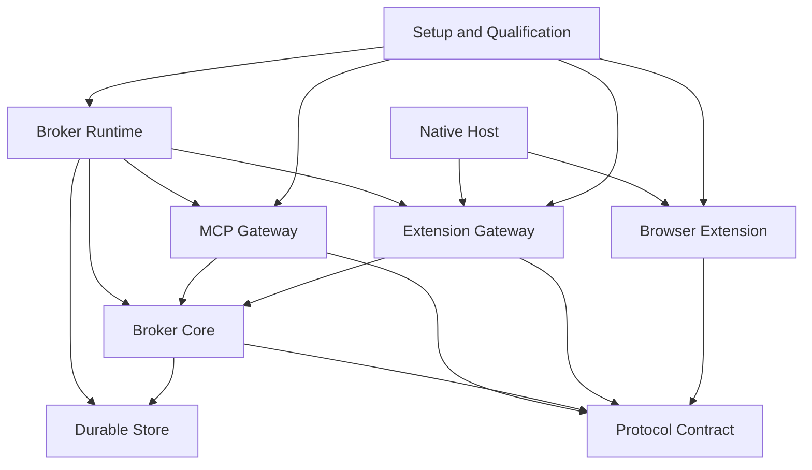

# Component architecture

Status: canonical Component decomposition for the implementation baseline.

Components are operational owners of confirmed System responsibilities. They may contain many modules, but no responsibility is shared implicitly: one component owns each decision or durable record, and collaborators communicate through explicit ports or versioned messages.

## Component map

### Eight components cover composition, agent access, broker policy, durability, extension transport, browser execution, shared contracts, and qualification

| Component | Repository owner | Primary responsibility |
| --- | --- | --- |
| Broker Runtime | `apps/broker/src/runtime` | Process composition, validated configuration, lifecycle, health, and dependency wiring |
| MCP Gateway | `apps/broker/src/mcp` and `apps/mcp-stdio-adapter` | Codex/Hermes transport adapters, caller evidence, twenty-two tools, schema publication, and acknowledgement-delivery confirmation |
| Broker Core | `apps/broker/src/core` and `apps/broker/src/profiles` | Logical identity, authority, admission, routing, workspace and Profile lifecycle, scheduling, reconciliation, controls, status, and audit decisions |
| Durable Store | `apps/broker/src/storage` | Atomic persistence, migrations, repositories, request/event/audit retention, and restart recovery queries |
| Extension Gateway | `apps/broker/src/extension-relay` and `apps/native-host` | Automatic relay-v2 endpoint registration, authenticated live connections, bounded framing, generation fencing, and extension message correlation |
| Browser Extension | `apps/browser-extension` | Profile identity, readable pairing code and automatic registration, browser observation, tab-group operations, `chrome.debugger` attachment, raw CDP execution, and event forwarding |
| Protocol Contract | `apps/shared/protocol` | MCP wire schemas, domain value types, relay envelopes, capability manifests, public problems, and protocol versions shared by runtime apps |
| Setup and Qualification | `tools` and `tests` | Installation, runtime registration, builds, fixtures, conformance, real-world scenarios, traces, and release evidence |

### Dependencies point inward toward contracts and broker decisions

Broker Core cannot depend on MCP, WebSocket, Native Messaging, Chrome APIs, or process-global configuration. Gateways translate transports into Broker Core ports. Durable Store implements repository ports and does not make routing or lifecycle decisions.

### Physical nesting makes the owning application visible from every source path

Broker Runtime, MCP Gateway, Broker Core, Durable Store, and Extension Gateway are separately governed components inside the `apps/broker` deployable. Their source modules are nested beneath that app because they ship and run as one broker process.

Browser Extension, Native Host, and MCP stdio adapter remain separate app directories because each produces an independently launched or loaded artifact. Protocol Contract is the sole shared source subtree because the broker, extension, and stdio adapter consume the same versioned wire definitions. Generated artifacts never live inside these source owners; root `dist/` contains every build product.

## Broker Runtime

### Broker Runtime builds one local application from validated dependencies

Broker Runtime loads local configuration, constructs storage, Broker Core, MCP Gateway, Extension Gateway, scheduler workers, event retention, and logging, then starts and stops them in dependency order.

It owns process signals, health endpoints, startup recovery sequencing, and configuration publication. It does not implement tools, routing policy, SQL queries, extension authentication, or CDP methods.

### Broker Runtime publishes discovery and owns the data-directory startup lock

The process entry point owns the PID lock and publication/removal of runtime records after listener binding. Runtime composition supplies the instance UUID in health and passes the bound relay URL to managed Profile bootstrap. Discovery does not replace the store's logical identity or request authority.

The shared Protocol Contract module owns the closed discovery schema, loopback validation, liveness check and atomic file operations. The session-owned stdio adapter owns MCP health/version/instance validation and reconnection before a new call; it preserves caller evidence and never retries a dispatched operation.

### Startup recovery finishes before external work becomes eligible

Startup opens and migrates the store, rebuilds logical indexes and lane barriers, restores control fences, initializes capability profiles, starts extension acceptance, reconciles live endpoints, and only then marks MCP mutation tools ready.

Readiness can distinguish `starting`, `reconciling`, `ready`, and `degraded`. A running HTTP listener alone is not proof that browser work is safe to accept.

## MCP Gateway

### MCP Gateway presents the exact version-two tool and schema catalog

MCP Gateway materializes every tool root from the canonical schema, validates all model-authored inputs, injects non-model caller evidence, invokes Broker Core application ports, and returns structured content plus a concise text fallback.

It supports runtime adapters for Codex and Hermes without changing tool bodies. Adapter configuration maps runtime evidence to the broker's session and lineage resolver; it never asks the model to compose caller, owner, or request identifiers.

### Acknowledgement delivery confirmation is an explicit gateway port

For an accepted asynchronous call, MCP Gateway writes the accepted ticket response and reports successful transport handoff to Broker Core. The broker does not make the ticket dispatch-eligible before that confirmation.

If transport handoff fails, the gateway reports failure. It does not retry the browser action, generate a replacement request, or infer that the model saw `request_ref`.

### Immediate reads remain bounded and scheduler-neutral

Context, event, and request reads call read-model ports. Terminal close calls one compare-and-write port. Gateway pagination validates page-size bounds and forwards opaque cursors without parsing their private contents.

## Broker Core

### Broker Core owns every logical decision and state transition

Broker Core is divided internally by responsibility:

- identity and authority resolution;
- endpoint, window, workspace, tab, and relationship registries;
- status projection and freshness;
- workspace allocation and deterministic ranking;
- request admission, acknowledgement gates, and lifecycle transitions;
- per-tab lanes, worker claims, control epochs, and backpressure;
- capability and managed-tab-scope admission;
- browser command, tab creation, child adoption, and event reconciliation;
- human resolution, stop, resume, kill, takeover, and termination coordinators; and
- audit-event construction.

These are modules inside one consistency boundary, not separate sources of truth.

### Application ports separate commands, queries, workers, and extension events

Broker Core exposes four port families:

| Port family | Callers | Examples |
| --- | --- | --- |
| MCP command ports | MCP Gateway | submit workspace, tab, CDP, resolution, control, takeover, termination |
| MCP query ports | MCP Gateway | context pages, request snapshot, event page, terminal close |
| Worker ports | Broker Runtime workers | claim next eligible request, checkpoint, reconcile, finish, release |
| Extension event ports | Extension Gateway | endpoint connected, browser snapshot, command result, CDP event, detach, disconnected |

All ports accept or return public references and typed facts where applicable. Only the extension port also carries private transport and browser locators, wrapped in fenced generation types.

### One transaction coordinator protects cross-entity invariants

Broker Core requests atomic store transactions for acceptance, acknowledgement outcome, lane-head claim, request terminalization, resolution, takeover, termination, control fences, public closure, and cursor-generation changes.

It never implements a distributed lock across MCP and extension transports. Durable epochs and compare-and-write conditions fence stale work.

## Durable Store

### Durable Store persists logical truth in SQLite transactions

The initial implementation uses one local SQLite database in WAL mode. Repositories expose typed transaction methods rather than arbitrary SQL to Broker Core.

The store owns schema migration and persistence for endpoints, pairing credentials, sessions and lineages, windows and their last-focus observations, workspaces, managed tabs, requests, request attempts, lane positions, control epochs, event streams, event pages, capability selections, status observations, public closure, and audit records.

### Separate tables preserve logical state, current locators, and append-only evidence

Logical entity tables hold current durable state. Generation tables hold replaceable connections, locators, attachments, and event streams. Append-only transition and audit tables record how current state was produced.

Raw bodies are stored only where required for an open request result or retained event page. Logs reference durable identifiers and hashes instead of duplicating large raw payloads.

### Repository queries rebuild schedulers and read models after restart

Recovery queries return open tickets, per-tab lane order, unconfirmed acknowledgement barriers, current control fences, possibly dispatched attempts, current owner authority, endpoint pairing, public terminal tickets, and event-stream generations.

Read-model queries implement bounded context and ticket-discovery pages with query, visibility, owner-epoch, ordering-snapshot, and cursor checks.

## Extension Gateway

### Extension Gateway registers first connections and authenticates later generations

For an unpaired relay-v2 extension, the gateway validates the two-word code format, proposed nickname, profile public key, and negotiated capability manifest, then asks the broker to register the endpoint automatically. The readable code supports human correlation and does not grant authority. A duplicate nickname belonging to another profile key returns `ENDPOINT_NICKNAME_CONFLICT` so the extension can preserve the requested label and wait for operator correction.

After registration, the gateway validates the persisted endpoint identity through challenge authentication, applies any requested alias change only after that proof, negotiates relay-protocol and capability versions, and registers one current connection generation. A replacement connection fences the older generation before it can return results. Relay-v1 broker-generated one-time codes remain migration-only behavior and are not part of the current installation journey.

Connection presence is a fact sent to Broker Core. Gateway never derives `usable`, `busy`, `failing`, workspace ownership, or retry policy itself.

### Native host carries production traffic while test transports share its schema

The native host frames stdin/stdout Native Messaging records and forwards them to the local gateway. Chrome and AdsPower installed profiles use this path so the extension never requires browser permission to open a loopback socket.

Native Host owns adjacent `relay-runtime.json` lookup and its relay URL/process checks. A missing file permits the legacy URL; an invalid present record fails. Relay authentication and browser identity remain Extension Gateway and Broker Core responsibilities.

An in-process or loopback transport can exercise the same envelope, authentication, size limits, and connection-generation behavior in automated tests or developer diagnostics, but it is not an installed-profile fallback. No transport buffers replayable browser event history. Reconnect triggers broker reconciliation and a fresh stream baseline.

### Gateway correlation never becomes public request identity

Private relay message and command-attempt identifiers correlate extension acknowledgements, results, and events. They are generated below the MCP boundary and mapped to durable requests only after Broker Core validates endpoint, connection, tab, attachment, and attempt generations.

## Browser Extension

### Each profile-local extension persists one identity, readable code, and nickname

The extension creates a cryptographic profile identity in profile-local extension storage, randomly selects and persists two short English words as its default code, combines them into a lowercase nickname without separators or digits, and starts automatic registration when the local transport connects. The options page accepts a replacement two-word code, previews the derived nickname, and displays Native Messaging readiness and connection status. Saving preserves the key and reconnects; a nickname-conflict response preserves the readable label and waits for another operator choice.

Ordinary service-worker or browser restart preserves the identity, saved code, and endpoint. When a paired profile changes its code, the broker authenticates the persisted key before atomically changing the legacy and canonical endpoint names. Reset, reinstall, or re-pair creates a new identity, generated code, and nickname candidate and cannot inherit old logical workspaces.

### Browser inventory reconciliation precedes managed-tab mutation

The extension reports eligible windows, focus, tab groups, tabs, opener relationships, URLs, titles, and debugger attachment facts. The broker maps those observations to logical references.

Create, group, move, archive-rename, attach, and CDP operations accept only private broker-resolved locators carrying the expected generation. The extension rejects stale or mismatched locators rather than searching by title or guessing a replacement.

### Chrome debugger execution is a versioned adapter over raw protocol data

The executor manages attachment per tab, invokes `chrome.debugger.sendCommand`, forwards `onEvent`, records `onDetach`, and supports flattened child sessions only when negotiated. It returns raw protocol results and errors without interpreting website success.

Recent private attempt outcomes may be cached only to answer broker reconciliation after transport loss. The cache is bounded, generation-aware, and never becomes a second public ticket journal.

## Protocol Contract

### Protocol Contract publishes separate agent, broker, and extension schemas

The package contains:

- the exact canonical MCP version-two JSON Schema and generated or hand-checked Zod validators;
- internal domain value types and reference brands;
- the versioned extension relay envelope and message schemas;
- the runtime discovery schema and atomic record operations;
- capability-manifest schemas and conservative profiles;
- public problem codes and private transport failure codes; and
- schema-version compatibility assertions.

Public MCP bodies cannot reuse a private relay envelope or Chrome identifier type accidentally.

### Capability manifests are generated from reviewed fixtures rather than live guesswork

Each supported extension/browser combination selects a checked-in capability manifest. Unknown combinations receive a conservative baseline. New method or parameter support requires contract tests and at least one real-browser fixture before it becomes eligible.

The manifest describes scope and support; Browser Extension executes. Broker Core decides admission.

## Setup and Qualification

### Installation scripts are idempotent and report explicit readiness

Under the [System installation contract](../04-System/System-Architecture.md#github-releases-install-immutable-runtimes-behind-stable-local-launch-and-extension-paths), Setup and Qualification owns the Hermes first-time setup flow, including Broker delivery and the current proxy capability. The Windows portable plugin installs its pinned runtime outside Hermes profile homes and supplies each enabled profile with a separate adapter. Setup and launch share an installation lock; failed setup restores prior configuration. Its [delivery record](../80-Plans/tabro-hermes-provider-2026-10-01/plugin-delivery-2026-10-04.md) records isolated verification and the remaining clean-machine browser gate.

Setup scripts build artifacts, register the native host, generate MCP configuration for Codex, register MCP configuration separately in the default and every installed named Hermes profile, print extension load paths, verify broker health, and explain automatic extension pairing. The Hermes helper discovers the installed profile directories when it runs and must run again after another profile is created. The scripts do not issue or require a pairing code; optional profile-local customization happens in the extension options. Re-running them repairs matching configuration without deleting pairing or workspace state unless reset is explicitly requested.

Runtime-specific templates remain separate from agent-visible MCP schemas.

This section assigns intended responsibilities; it is not a blanket claim that every helper already conforms. The File runbook records the current URL-based preflight limitation, saved-URL Demo caller and isolated native-probe gap. System records unimplemented general scheduler bounds and log/audit/event retention. Their owners remain responsible for closing and verifying those gaps.

### Setup tooling reuses one shared runtime and keeps migrations explicit

The local startup helper owns launch serialization and matching-instance reuse. Source/installed launchers and registration helpers select runtime-file and token-file paths. Release staging advertises discovery support, and the updater validates it before stopping an installation. Demo preparation owns its fixture and trace manifest while reusing the shared Broker.

The Hermes migration CLI owns plans, backups, verified application and rollback of active-reference changes. The database merge CLI writes a separate output database and owns schema, identity and integrity conflict checks; the operator owns source-store backups and deployment switching. They do not redefine Profile or workspace authority or run automatically during ordinary startup. Operator qualification must supply discovered URLs to older diagnostic helpers that still default to fixed ports.

### Release tooling owns package integrity while the gateway and extension own reload fencing

Setup and Qualification bundles portable broker and MCP adapter entries, builds the versioned native executable and unpacked extension, generates the per-file release manifest, publishes the archive checksum, and performs verified staged installation. It owns download, checksum and manifest validation, versioned release directories, stable launchers, Native Messaging registration, health confirmation, and rollback of a failed startup.

Extension Gateway compares the connected extension version with the broker's required version and withholds Broker Core readiness when reload is required. Browser Extension owns the one-reload decision and repeated-mismatch guard. Neither component changes profile identity, pairing, workspace truth, or request truth during an update.

### Automated tests progress from pure invariants to real browsers

| Layer | Evidence |
| --- | --- |
| Contract | JSON Schema compilation, Zod parity, closed inputs, tool catalog, relay-version compatibility |
| Unit | ranking, authority, status, state machines, lanes, epochs, retry bounds, retention, problem mapping |
| Integration | SQLite transactions, restart recovery, acknowledgement gating, gateway fencing, extension mock protocol |
| End to end | multiple agents, endpoints, workspaces, tabs, controls, reconnects, takeover, and termination |
| Real world | Codex plus Hermes, Chrome plus AdsPower, distinct profiles, native transport, physical close/reopen, soak and fault evidence |

### Qualification evidence changes the design only through an owned proposal

A failing test can fix an implementation defect directly when the canonical behavior is clear. A test that demonstrates an incompatible runtime or unusable threshold produces a proposal at the owning UX, UI, System, Component, or File level before changing canonical behavior.

## Profile management

### The Broker Profile Manager coordinates lifecycle operations before workspace allocation

Broker Core lists authenticated extension identities directly, enriches them with broker/user launch ownership from the launch directory, and exposes the same ownership in endpoint and window facts. Discovery works without a configured launcher and uses the extension alias as the sole public Profile name. SQLite migration 007 removes the second Profile name from storage and Profile ticket history; the migration runner normalizes creation hashes in the same transaction. The Profile model and repository accept no extra name. The Profile Manager under `apps/broker/src/profiles` owns the persistent launch directory, launcher coordination, instance observations, ready predicate and stopping barrier. ProfileRequestService integrates principal-scoped lifecycle requests with durable admission, acknowledgement, worker claims and terminal facts. ChromeLauncher owns the Windows process check and private lifecycle connection. BootstrapGrants owns credential validation and atomic binding after signed AUTH. The existing extension relay remains the website execution owner.

## Profile networking

### Network services separate configuration, credential custody and extension application

ProfileNetworkService owns MCP authorization, broker-only proxy operations, durable tickets, revisions, closed-Profile admission and deferred reconciliation. ProxyRepository stores bindings, requests, observations and private listener reservations. ProxyCredentialStore protects credentials with Windows DPAPI CurrentUser. ProxyGatewayManager owns bounded loopback listeners and authenticated upstream connections. ExtensionProxyController applies and reads back Chrome settings and performs fixed-origin exit-IP probes. ProfileManager and ChromeLauncher verify process closure independently of extension connectivity and integrate next-launch readiness and startup routing. Network operations are explicit capability-advertised relay messages, not browser-wide CDP.

Parent: [`Components MOC`](./_MOC.md).
